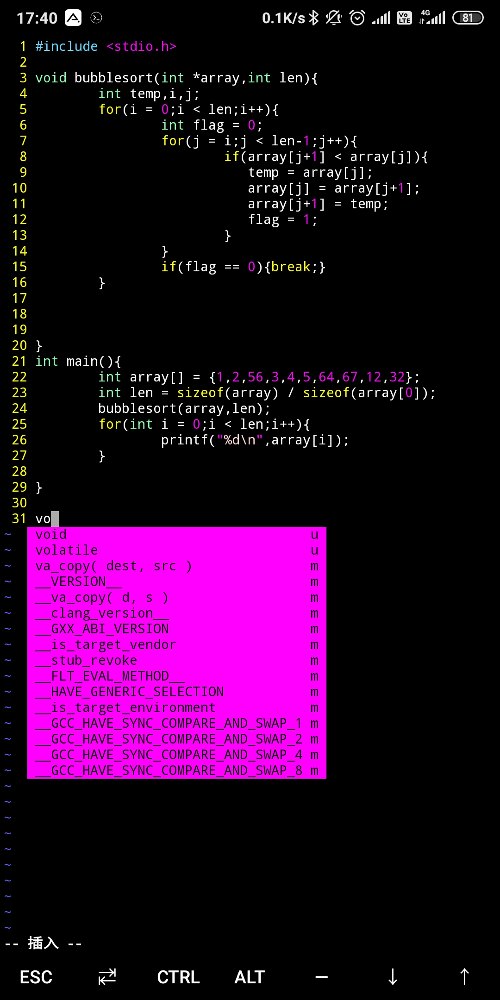

# My_pocket_dev_env
A tutorial for installation of VIM-YouCompleteMe &amp; Linux-repo in Termux(Android terminal emulator)

中文用户[请点击](zh-CN_README.md)
## Installation guide
- First,install Termux on your Android phone from google play store OR an apk package(No root needed)

Open your Termux
### Install Atilo
> what's Atilo?<br>
> A program to install linux on termux

- Type these code
```bash
echo "deb [trusted=yes arch=all] https://yadominjinta.github.io/files/ termux extras" >> $PREFIX/etc/apt/sources.list
pkg update
pkg in atilo
```
- More info about Atilo installation [Click here](https://github.com/YadominJinta/atilo/blob/master/README.md)

- Then intall linux distribution which you want on Termux
```bash
atilo [command] [Arguments]
Atilo           2.0
Usage: atilo [Command] [Argument]

Atilo is a program to help you install some GNU/Linux distributions on Termux.

Commands:
images           list available images
remove           remove installed images
pull             pulling an image
run              run an image
clean            clean tmps
help             show this help.
```
- Simply just run
```
atilo pull [Linux image you want]
atilo run [Image you pulled before]
```
### Install VIM & Youcompleteme
- I just use Ubuntu 20.04LTS for my daily usage
so it's easily to install vim-youcomplete through 
```bash
apt-get install vim vim-youcompleteme
```
This command is so quick to install youcompleteme

But I haven't test other distributions yet.
### Configure .vimrc configuration file
My vimrc is [Here](https://github.com/zhzhzhy/My_vimrc)

### Here is an example for VIM autocomplete

